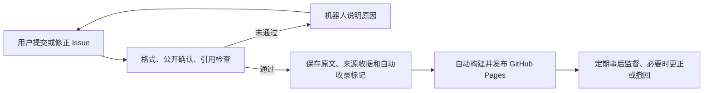

# GitHub Issue 自动归集

普通投稿走这条链路：

## 已有能力与费用

本仓库公开，采用标准 `ubuntu-latest` runner。GitHub 对公开仓库的标准运行器免费；Pro 每月额度主要用于私有仓库，本流程不需要付费模型、个人 PAT、常驻服务器或审批机器人。[GitHub Actions 计费](https://docs.github.com/en/billing/concepts/product-billing/github-actions)

## 触发、去重与发布

- `intake.yml` 监听 Issue 新建、编辑、重开、标签变化；首次部署后可手动运行一次，补收已有投稿。普通反馈、PR、机器人投稿与未收录的已关闭 Issue 不导入。
- 每次运行重新扫描全部开放 Issue，6 小时一次定时补扫。即使事件被合并、排队超额或推送冲突，下一次运行仍能发现未完成投稿。GitHub 定时任务不是精确定时服务；公开仓库长期没有活动时，GitHub 可能暂停定时工作流，Issue 事件仍是主要入口。[工作流事件与 schedule 限制](https://docs.github.com/en/actions/reference/workflows-and-actions/events-that-trigger-workflows)
- 所有归集运行串行，`queue: max` 保留最多 100 个待运行项。提交采用普通推送，禁止强推；与人工更新发生冲突时失败保留远端内容，后续扫描从最新 main 重新处理。[并发队列](https://docs.github.com/en/actions/how-tos/write-workflows/choose-when-workflows-run/control-workflow-concurrency)
- 一条 Issue 最多自动收录一次，成功收据与正文原子保存。机器人评论和标签引起的 `updated_at` 变化不会增加记录；首次成功后编辑正文不会覆盖历史。不同 Issue 的同一段文字仍可独立收录。
- 只有内容校验与构建通过后才提交 `content/`；代码、工作流、依赖都不能来自 Issue。每条投稿失败不会妨碍同批其他有效投稿。
- `GITHUB_TOKEN` 创建的提交不会触发普通 `push` 工作流，因此归集显式调用可复用的 `deploy.yml`，传入实际内容提交 SHA。构建精确版本，发布前再确认它仍是当前 main，防止旧版本覆盖新版本。[Token 行为](https://docs.github.com/en/actions/concepts/security/github_token)
- 即使反馈失败，只要内容已提交仍会尝试发布。定时或手动运行会重试发布，即使没有新增内容；发布失败时原网站保持可用。

## 状态与事后操作

机器人只更新自己的一条状态评论，避免每次补扫刷屏；标签只表示处理进度，不赋予审批权限。

| 标签 | 含义与下一步 |
| --- | --- |
| `intake:collected` | 原文和来源已保存；等待成功部署后链接可用 |
| `intake:needs-info` | 投稿者按机器人说明修正原表单，保存后自动重试 |
| `intake:amended` | 首次收录后源 Issue 有变化；历史原文保持不变 |
| `intake:paused` | 维护者临时暂停该条归集；删除标签后自动重试。不会撤回已发布内容 |

关闭 Issue 不会撤回正文；网站内容的事后处理使用 [维护工具](../CONTRIBUTING.md)。每份自动收据和发布元数据标记 `intake_method: github-actions`，旧版本未标记的记录属于原人工流程；兼容字段 `reviewer/reviewed_by` 在自动记录中保存执行者，不代表人工审核。

社区关联为 `submitted`，在网站显示提出者；人工确认关联为 `confirmed`。词项算法候选 `proposed` 仍不会发布。自动化只检查结构、可见性和片段确实出现在原文中，不判断语义关系和观点是否正确。

## 一次性启用条件与恢复

工作流必须合并到默认分支 `main` 才会监听 Issue。当前仓库使用 Actions Pages，main 没有保护规则；工作流显式申请 `contents: write`、`issues: write`，发布作业独立申请 `pages: write` 和 `id-token: write`。不需要把仓库默认 token 权限改为全局可写，也不需要允许机器人审批 PR。

如以后增加强制 PR、签名或指定检查等分支规则，自动推送可能被拒绝；届时应改为专用数据分支或配置有明确范围的 GitHub App，而非让每个投稿重新回到人工审批。[仓库规则](https://docs.github.com/en/repositories/configuring-branches-and-merges-in-your-repository/managing-rulesets/about-rulesets)

暂时停止全体自动归集可在 Actions 禁用 `Collect issue submissions`，已发布网站继续可读。恢复后重新启用并运行一次即可。工作流运行日志和原 Issue 是排查入口；不需要维护者定时在电脑上执行导入命令。
