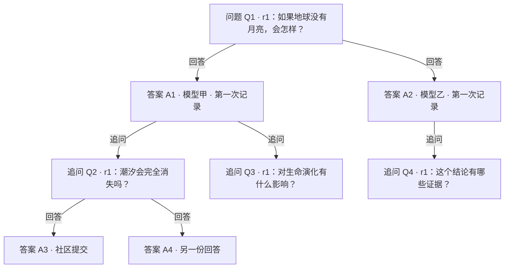
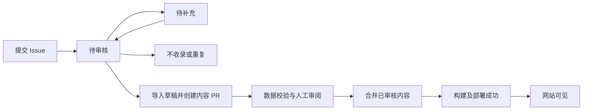
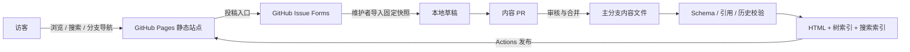

# QandA：可分支的问答探索档案设计

状态：首版代码已实现，本地验收通过；公开访问配置与真实用户试用待完成。更新日期：2026-09-06。

实现和运行入口见 [README](../README.md)，实际验证记录见 [verification.md](verification.md)。下文保留设计判断与当时的工作量估算，不能把它们当作已经完成的用户研究。

输入：`docs/intent.md`，以及补充需求「访客可以提问、提交生成的答案」「回答之后可以追问，多个追问形成分支，需要管理与可视化」。原文后续增加的「分析并确定不同问题、不同分支之间的关联，将它们连接起来」也纳入本设计。原设计时项目尚无应用代码；现已增加首版实现，具体目录和命令以实现说明及维护文档为准。

## 1. 评价与可行性结论

**值得做一个小规模、可公开使用的版本。** 建议定位为：以有趣的问题为起点，让不同来源的答案、进一步的追问和探索路径持续积累的公开档案。

价值主要来自四个方面：

- **收藏好问题。** 让稍纵即逝的好奇心成为可以搜索、分享和继续探索的内容。
- **保留回答的来历与差异。** 同一问题的不同答案可以并排阅读，并追查其来源、时间和已知生成条件。
- **保存思考怎样展开。** 分支让「答案引出了什么新问题」成为可浏览的结构，后来者可以从中间某一步继续。
- **连接不同路径的发现。** 某条分支中的解释可能帮助理解另一处问题，横向关联让读者能够发现这些连接，并查看关联理由。

其中，追问分支使产品的价值更加明确：积累的对象从孤立的问答扩展为可继续的探索路径。实现这些功能无需先建设复杂的在线模型服务。

### 1.1 哪些可行，哪些存在边界

| 目标 | 判断 | 条件或边界 |
| --- | --- | --- |
| 保存问题、答案和历史版本 | 可行，复杂度较低 | 用结构化文件保存实体，Git 保存编辑历史 |
| 访客提交问题、已有答案和追问 | 可行 | 首版采用 GitHub 表单投稿、维护者审核，需要 GitHub 账号和页面跳转 |
| 展示多答案、时间线和追问分支 | 可行，复杂度中等 | 静态构建生成索引，浏览器负责筛选、展开和比较 |
| 发现并连接跨分支关联 | 可行，复杂度中等 | 首版采用文本候选检索、人工确认和局部关联图；自动认定语义关系仍需验证 |
| 同名模型在不同时点的答案留档 | 可行 | 如实记录可观测信息，允许实际版本未知 |
| 从答案变化推断服务方暗中换版 | 无法可靠成立 | 随机性、上下文、提示词、工具和服务默认参数都可能导致差异 |
| 验证公众需求和持续贡献意愿 | 尚未验证 | 需要真实读者、投稿者和维护者试用 |
| 全部功能只用 GitHub Pages 承担 | 有边界 | Pages 承担静态展示；投稿由 GitHub Issues 承担；未来站内写入和实时调用需额外服务 |

GitHub Pages 可以托管 HTML、CSS、JavaScript 静态站点。树导航、客户端搜索、答案切换和并排阅读可以在浏览器实现；它本身没有保存投稿的应用后端。[GitHub Pages 官方说明](https://docs.github.com/en/pages/getting-started-with-github-pages/what-is-github-pages)

### 1.2 最可能失败的地方

1. **内容很多，阅读收获很少。** 单纯堆放模型长回答会带来负担。以问题和探索路径组织内容，允许维护者写简短的「共识、分歧、待验证点」，每条说明指向原始答案。
2. **主题太散，缺少回访理由。** 先围绕维护者愿意持续探索的一个或两个主题积累内容，数据结构保留通用性。
3. **投稿和审核过于麻烦。** 允许直接粘贴已有答案；不知道的模型参数不必填写。先观察 GitHub 投稿门槛是否阻碍真实用户，再决定是否建设站内表单服务。
4. **分支增加后容易迷路。** 默认沿一条路径阅读，树形目录辅助导航；全文留在阅读区。
5. **把模型输出当成已核实的知识。** 来源完整、审核收录和事实正确是三件不同的事。界面分别表达，并允许给历史答案添加更正说明。

以上产品判断是设计假设，尚未经过市场或用户研究验证。

## 2. 第一版的范围与取舍

第一版面向好奇心驱动的读者、愿意分享提问记录的人，以及负责整理内容的小规模维护团队。

### 2.1 必须交付

| 能力 | 第一版行为 |
| --- | --- |
| 浏览和发现 | 问题列表、主题标签、中文搜索、最近新增内容 |
| 独立提问 | 访客提交一个新的根问题；可以尚无答案 |
| 提交答案 | 向明确的问题版本粘贴一份已有模型答案，允许元信息未知 |
| 多答案 | 同一问题版本容纳多个模型、多个日期、同模型多次生成的答案 |
| 追问 | 在一份具体答案下提出新问题；追问也可有多个答案和更深追问 |
| 分支阅读 | 当前路径、可折叠树目录、定位父节点、回到起始问题、稳定分享链接 |
| 横向关联 | 简单候选分析、人工提出与确认关联、关联理由和局部可视化 |
| 答案比较 | 选择同题的两份答案并排阅读，展示来源及条件差异 |
| 内容管理 | 投稿审核、问题修订、注释纠错、分支归档和撤回 |
| 历史追溯 | 固定问题版本、保留答案原文、来源声明和录入记录 |

### 2.2 首版实现假设

- 访客生成答案后提交；平台首先解决收录、组织和展示。模型自动调用作为后续增强，不阻碍首版完整交付。
- 网站提供「提个新问题」「提交本题答案」「追问这份回答」入口，跳转 GitHub Issue Forms。投稿入口明确标出需要 GitHub 账号、投稿公开、审核后进入网站。
- GitHub 账号与跳转流程是本设计为降低首版成本选择的方案，用户尚未指定必须采用它。若要求匿名、站内提交或提交内容审核前保密，应转用第 11 节的投稿后端方案。
- 网站展示中文内容为主，首版处理文本和 Markdown。聊天导出文件可辅助审核；整段聊天自动解析成树、多模态回答与附件上下文解析暂缓。

首版暂缓：实时聊天、公开付费模型调用、模型排行榜、自动事实裁判、投票声望系统、多父上下文合并和自由拖拽图编辑。

## 3. 核心结构：问题、答案与追问

### 3.1 两种分支关系

**同题多答案**：对同一问题版本有多个回答。

**回答后的追问**：针对某一份具体回答提出一个新问题，新问题可以继续获得多个答案。



示例只说明结构，不代表对题目给出了科学结论。

首版主结构是一组树：一个根问题对应一棵探索树，一个追问只有一个父答案。另用关联边连接不同问题或答案，整体形成「探索树 + 横向关联网络」。关联可以跨树，但不参与上下文继承。这个约束让主阅读路径唯一，文件和索引即可承载，无需图数据库。

### 3.2 身份与版本规则

- `question_id` 表示问题节点。根问题的 `parent_answer_id` 为 `null`，追问固定指向一个已存在的 `answer_id`。
- `revision_id` 表示该问题的一版完整提问文本及背景。改动会影响模型输入的内容，即使只是措辞，也产生新修订。
- `answer_id` 表示一份取得的回答，固定关联一个 `revision_id`。再次生成总是新答案，不覆盖旧记录。
- 追问是新问题节点；更正同一个问题的表述才是新修订。
- 标题标签等纯展示信息可以编辑。凡是实际送进模型的文本都必须进入修订或输入快照，不依赖浮动标题。
- 编辑祖先问题不会把后代迁到新版本：父答案引用的旧修订决定历史路径。树中旧版回答显示对应修订标识。
- 把追问放到另一份答案下时，创建新问题并记录 `copied_from_question_id`，原分支保留。复制文字不意味着两个节点共享上下文。
- 分支归档表示暂不继续整理，仍可阅读；普通撤回保留 ID 和占位说明，避免后代链接失效。

### 3.3 管理规则

维护者通过内容 PR 管理分支。可以修改展示标题和标签、增加修订、添加注释、归档分支。错误挂接尚未发布时可修正；发布后需新建正确节点、说明替代关系，避免悄悄改变历史。

分支归档由问题节点上的状态决定，其后代沿祖先链继承只读展示状态。投稿审核时重新检查归档状态，避免旧页面入口绕过限制。重新开放需要维护者明确撤销归档。

同文问题允许在不同上下文中存在。去重只提出建议；通过独立的 `Relation` 记录横向关联，首版不将已有分支自动合并。

### 3.4 关联的发现、确定与连接

关联挂到具体的问题修订或答案，而非会变化的「最新内容」。首版采用三类：

| 关系类型 | 方向与适用范围 | 确认所需信息 |
| --- | --- | --- |
| `related_topic`：主题相关 | 双向，可连接问题修订或答案 | 说明共享的主题或概念；不表示两个问题等价 |
| `supports`：观点支持 | 有向，源答案的一段内容支持目标答案中的具体观点 | 双方原文片段、支持理由及适用条件 |
| `conflicts_with`：观点冲突 | 双向，连接两份答案中的具体观点 | 双方原文片段、冲突理由；确认讨论对象、时点和前提可对齐 |

一次关联只表达一种具体关系；同一对长答案可以在不同片段上有不同关系。支持与冲突的标注也可能有误，维护者确认表示认可这条关联说明，不代表完成了事实核验。关联可被纠正或撤回。

首版工作流：

1. **分析候选。** 对新增的已发布问题修订和答案提取文本，按中文二元字组、英文词和标签建立词项索引，用 TF-IDF 余弦相似度检索跨分支候选。每个节点先取不超过 5 个达到配置阈值的结果；保留匹配词和分数。分数仅用于排序，不能解释为关系成立的概率。
2. **补充判断。** 维护者查看候选双方的具体文本和父路径，选择关系类型、补充理由。自动候选只能建议「主题相关」；支持和冲突需另行判断，不从相似度推导。
3. **人工提出。** 访客也可提交两个节点链接和关联理由，进入独立的关联投稿表单。人工路径允许发现词汇不同但概念相关的内容。
4. **确定关系。** 维护者确认、驳回或要求补充。支持/冲突必须带原文片段；表单字段和片段均经校验，不能只填模型结论或分数。
5. **发布连接。** 已确认关联随内容 PR 合并发布，在双方节点显示关系说明与跳转，并进入局部关联图。候选只留在审阅队列，不默认作为已确认关系展示。

候选分析使用有版本号的配置；记录算法版本、内容哈希和匹配依据。已驳回的相同端点、相同内容版本候选不反复出现，人工可以重新打开。文本检索会漏掉同义改写或深层概念关系，首版不承诺发现所有关联；用人工标注的小样本观察质量，再决定是否增加向量召回或模型辅助分类。

横向关系允许构成环，但不能改变 `parent_answer_id`，不能自动合并分支，也不能自动进入复制或生成的上下文。用户以后选择引用关联内容时，需要显式加入输入并记录新的快照。

## 4. 数据模型与完整性

### 4.1 持久化实体

采用 JSON 保存元信息，UTF-8 Markdown 保存提问和回答正文。每个实体使用独立、稳定的 ID；`q-001` 等短 ID 仅用于本文示例，实现时可使用带类型前缀的 UUID。文件中保存 `schema_version`，迁移通过明确的迁移脚本进行。

| 实体 | 关键字段 | 约束 |
| --- | --- | --- |
| Question | `id`, `parent_answer_id`, `current_revision_id`, `title`, `tags`, `created_at`, `created_by`, `state`, `copied_from_question_id` | 父答案建立后固定；`state` 仅为 `active/archived`；当前修订显式指定 |
| QuestionRevision | `id`, `question_id`, `body_path`, `body_sha256`, `created_at`, `created_by`, `change_note` | 已发布文本不可原地修改 |
| Answer | `id`, `question_revision_id`, `body_path`, `body_sha256`, `submitted_at`, `submitted_by`, `provenance`, `generation`, `context`, `run_id` | 导入答案允许 `run_id: null`；正文不可原地改写 |
| ContextSnapshot | `id`, `capture_kind`, `messages`, `path_refs`, `attachments`, `sha256` | 记录实际取得的上下文；不能按当前树倒推历史事实 |
| Annotation | `id`, `target_type`, `target_id`, `kind`, `body_path`, `author`, `created_at`, `evidence_urls` | 人工解释与原始输出分开；事实核查记录明确范围与依据 |
| Relation | `id`, `source_ref`, `target_ref`, `type`, `rationale`, `source_excerpt`, `target_excerpt`, `origin`, `proposed_by`, `created_at`, `method_version`, `candidate_score`, `decision`, `decided_by`, `decided_at` | 端点固定到修订或答案；`decision` 为 `proposed/confirmed/rejected`；确认之后才可发布 |
| Publication | `entity_type`, `entity_id`, `state`, `reviewed_by`, `reviewed_at`, `source_issue_url`, `source_updated_at`, `source_body_sha256` | `state` 为 `published/withdrawn`；缺少发布记录则不进入公开构建 |
| GenerationRun（后续） | `id`, `question_revision_id`, `context_snapshot_id`, `protocol_revision_id`, `request_path`, `request_sha256`, `adapter_version`, `status`, `usage`, `error` | 平台调用才创建；一次运行可能失败并且没有答案 |

`Publication` 记录问题、修订、答案、注释和关联的发布资格；撤回状态只由它决定，实体不重复保存另一套撤回状态。关系的 `decision` 表示审阅结论，发布记录表示是否上线：只有 `confirmed` 且 `published` 的关系进入网站。已发布关系的端点、类型和理由修改时创建替代记录，原关系撤回；关系 ID 不复用。

`Question.current_revision_id` 必须指向本问题的一个已发布、未撤回修订；草稿可为 `null`。撤回当前修订时须同时指定另一有效修订，或撤回问题并显示占位，不能按创建日期隐式选择。

关系的 `source_ref/target_ref` 包含 `entity_type`、`entity_id` 和 `body_sha256`；方向以源指向目标。`origin` 表示人工提出或词项检索，`proposed_by` 保存实际提交者或运行脚本标识。自动发现不填写人工确认字段。

上下文快照只能通过已发布答案引用进入公开导出，并单独经过公开内容检查。待审草稿留在本地工作目录或待审 PR，公开站点只使用发布清单。归档是问题的整理状态；撤回是公开展示状态，两者用途独立。

这里的审核控制**网站收录范围**。公开仓库的 Issue、PR 和已提交文件仍可被访问，不能用 `draft` 字段制造隐私承诺。

### 4.2 模型身份和来源

每份答案的 `provenance` 记录：

- `kind`：`community_paste`、`community_export`，或后续的 `maintainer_api`。
- `source_url`：原始分享链接或投稿链接，允许缺失。答案正文必须本地留档，不能只依赖可能失效的分享链接。
- `identity_evidence`：`submitter_reported`、`platform_captured` 或 `unknown`。提交者上传的 API JSON 仍属于提交者提供的材料，不自动获得平台捕获标识。

`generation` 记录供应商、渠道、原样模型显示名、请求的模型 ID、响应返回的模型 ID、明确公开的版本标识、生成时间及时间精度。实现另保存提交者提供的 `protocol`（生成规则原文）；没有材料时为 `null`，不能仅凭系统指令或参数相同推定协议完整。未知字段用 `null`，并允许描述缺失原因。

生成时间与提交时间分开；只知道某一天就保留日期和 `day` 精度，不能伪造精确时分秒。网页显示名、API 模型 ID 和底层真实版本也分开，不把日期拼接成推测的模型版本。

来源材料完整不代表答案正确；内容审核通过也不自动赋予「事实已核验」。核查通过注释记录，例如「已核查第 2 段涉及的某项事实」，不默认对整篇盖章。

### 4.3 社区导入示例

以下是目标问题已存在时，一份元信息不完整的答案记录示意，关联的发布记录另存：

```json
{
  "schema_version": 1,
  "id": "a-003",
  "question_revision_id": "q-002.r1",
  "body_path": "answers/a-003/body.md",
  "body_sha256": "<由导入器计算，不接受提交者指定>",
  "submitted_at": "2026-09-06T01:00:00+08:00",
  "submitted_by": "github:example-contributor",
  "provenance": {
    "kind": "community_paste",
    "source_url": null,
    "identity_evidence": "submitter_reported"
  },
  "generation": {
    "provider": null,
    "channel": "web_chat",
    "display_name": "提交者看到的模型名称",
    "requested_model": null,
    "returned_model": null,
    "declared_version": null,
    "generated_at": "2026-09-05",
    "time_precision": "day",
    "parameters": null,
    "tools": "unknown",
    "finish_state": "unknown"
  },
  "context": {
    "snapshot_id": null,
    "capture_kind": "unknown",
    "visible_history_completeness": "unknown",
    "matches_site_path": "unknown"
  },
  "run_id": null
}
```

`capture_kind` 可为 `platform_request`、`submitter_transcript` 或 `unknown`；可见历史完整度为 `complete/partial/unknown`。这里的完整只针对所声明的可见对话，绝不声称捕获了服务方隐藏指令或内部状态。

### 4.4 构建必须检查的不变量

1. ID 全局唯一；所有内容路径位于允许目录内；正文哈希与文件一致。
2. 答案引用的修订存在且属于有效问题；追问引用的父答案存在；注释目标、上下文快照的站内 `path_refs` 和关系端点均可解析。外部历史作为外部消息保存，不伪装成缺失的本站节点。
3. 沿 `Question → parent Answer → QuestionRevision → Question` 检查无环；横向关联不参与此检查和上下文继承。
4. 发布子节点时，其结构祖先必须可解析且有公开版本或撤回占位。不能悄悄跳过待审祖先。
5. 对比基准版本后，已发布正文、修订所属问题、答案所属修订、问题父关系不得被覆盖；发现改动要求新记录。明确的敏感内容移除按专门撤回流程处理。
6. 来源未知不能被补成平台捕获；导入数据中的作者、审核人、捕获级别由维护者核验，不信任用户可编辑的同名字段。
7. 同一来源快照的重复导入只生成一次；确实独立生成但正文相同的答案可以共存。内容哈希不能代表语义相同或同一次生成。
8. 派生索引可以删除重建；原始内容和身份关系不能只存在于构建输出。
9. 已发布关系的两端必须已发布；端点的类型、ID 和正文哈希一致，证据片段确实存在于对应正文。双向边的端点顺序规范化，结合类型与片段去重；有向边保留方向。若任一端点撤回，关系及其说明、证据从公开视图与索引移除；相关注释也检查是否间接泄露正文。

## 5. 上下文、比较与再生成

### 5.1 组织路径不等于实际生成输入

树描述「在本站接着哪份答案讨论」，输入快照描述「取得这份答案时实际用了什么」。两者必须独立记录。

用户把一份外部生成的答案挂在 Q2 下，不代表当时模型看过本站 Q1 → A1 → Q2 的完整历史。可以提交完整聊天记录、部分上下文或说明未知；页面据此标注，审核不能代为编造缺失上文。

若提交者实际提问与目标修订不一致，按以下规则处理：相同意图但措辞不同则新增问题修订，意图或父上下文不同则新建问题；无法判断时保留待补充状态。接收元信息缺失与认定为严格同题比较是不同门槛。

### 5.2 从分支继续生成

第一版提供「复制当前路径」：按历史引用导出可见的提问与回答，供访客在自己的模型工具中继续，再把结果提交回来。复制内容不包含其他兄弟答案和兄弟追问，并附上其对应节点与版本。

后续若加入维护者 API 调用，组装规则为：

```text
固定的生成协议与系统指令
→ 根问题的历史修订正文（user）
→ 所选父答案原文（assistant）
→ 沿当前路径的下一轮追问正文（user）
→ 所选回答原文（assistant）
→ 当前追问的指定修订正文（user）
```

在发送前保存实际消息数组和请求参数快照。跨模型续答时，将旧答案作为提供给新模型的历史文本，并标明「基于导入对话继续」，不宣称恢复了原服务的会话内部状态。

如果上文过长或有撤回节点，禁止静默截断后仍声称完整上下文：要求选择明确的裁剪或摘要方案，记录变换、保留范围及新输入快照。根据现存可见路径发起的是一次新请求；缺失原历史不会因这次请求而被补齐。

### 5.3 比较方式

| 比较模式 | 展示和限制 |
| --- | --- |
| 同题阅读比较 | 同一问题节点的答案可选；默认同一修订，跨修订时先展示题目差异 |
| 条件对齐比较 | 已知提问修订、输入历史、协议和显式参数相匹配；突出未知项和提供商差异 |
| 跨时间观察 | 按真实生成时间排列；时间未知者单独分组，不能用提交时间替代 |
| 分支探索比较 | 比较两条思考路径，仅解释路径如何不同，不包装成同题模型能力评测 |

前两个模式在首版提供；跨时间观察可以是答案列表的筛选排序；跨分支双路径比较留待后续，首版通过树导航查看。

后续生成器分别计算：`input_sha256`（实际消息）、`protocol_sha256`（协议和显式选项）、`request_sha256`（含模型标识的完整非机密请求）。采用固定版本的 JSON 规范化规则；消息顺序、文字、缺省与显式 `null` 的区别必须保留。不能直接把包含模型名的请求哈希当成跨模型比较分组键。

上述哈希用于核查记录和提示条件差异，不保证供应商内部处理一致。单次差异不构成能力升降或版本变化的证据。若做稳定性观察，应固定一组问题和协议、在同一时间窗重复采样，完整保留样本及失败记录；本项目首版不输出统计排名。

## 6. 访客投稿与维护流程

### 6.1 三个主要入口

| 入口位置 | 按钮 | 需要的信息 |
| --- | --- | --- |
| 全站导航 | 提个新问题 | 问题正文；可选背景、标题、主题 |
| 问题详情，明确所选修订 | 提交本题答案 | 问题版本、答案正文、已知来源；其余可选或未知 |
| 某份答案下方 | 追问这份回答 | 父答案链接或 ID、追问正文；可选附带已生成答案 |

各节点的「关联内容」区域另设「建议关联」入口：选择目标节点链接、关系类型和理由，走同样的审核流程。该入口用于连接已存在内容，不创建新的上下文父节点。

问题与其第一份答案可在同一投稿中提交。追问也可附带答案，维护者以一个 PR 原子收录问题修订、答案和关联记录。新问题没有答案时显示「等待回答」，仍能浏览和分享。

GitHub Issue Forms 支持配置输入、文本区域和下拉等字段，提交内容会转换为可编辑的 Issue 正文。因此表单用于辅助填写，导入器仍需重新校验所有字段。[Issue Forms 官方语法](https://docs.github.com/en/communities/using-templates-to-encourage-useful-issues-and-pull-requests/syntax-for-issue-forms)

按钮带上模板及目标 ID；若字段预填不可用，网站提供目标链接复制，表单允许粘贴定位信息。不要把整篇答案或整条上下文编码到跳转 URL，以免产生过长链接或泄露正文到浏览记录。

投稿者最少只需提供可识别的目标、正文和公开提交确认。模型名称、生成日期、工具状态与历史上下文允许填「未知」。分享链接和原始导出属于可选证据，不能强迫用户填写拿不到的内部参数。

### 6.2 收录状态



「已合并」和「已上线」分开。部署失败时，原站点继续提供旧版本，投稿仍可通过 Issue/PR 追踪；网站页脚显示内容提交版本和构建时间。

维护者检查关联位置、可读性、明显的隐私或密钥泄漏、来源声明与重复内容，按需添加事实性注释。首版不要求逐条事实核验后才能收录，但所有未核验答案明确标识。

导入器固定本次 Issue 正文快照及更新时间，生成草稿后不随 Issue 编辑自动变化。再次编辑需重新导入和审阅。标签只用于整理工作队列；公开发布的依据是被合并的内容和发布清单。

首版导入由维护者本地执行，PR 检查和网站构建不调用付费模型。用户提交、Issue 编辑或添加标签都不直接触发模型费用或自动上线。

### 6.3 分支投稿的异常处理

- 父答案或问题版本不存在：保留待补充，不自动挂到最新版。
- 指向已归档分支：维护者决定重新开放，或建议新建根问题并关联原分支。
- 脱离上文无法理解的追问：需要明确父答案；如果依赖未导入的外部内容，要求补充必要背景。
- 答案依赖未知外部历史：允许以「生成上下文未知」收录；比较界面显示该限制。
- 原答案错误：添加更正注释或新答案；追问原错误观点的历史路径保留。
- 关联端点被编辑或撤回：编辑生成新修订，旧关系不自动迁移；撤回端点后隐藏相关证据，确认新的关系需要重新审阅。

## 7. 页面与可视化设计

### 7.1 信息架构

所有路径相对于站点部署基路径；显示标题可变，URL 使用稳定 ID。

| 页面 | 路径示意 | 内容 |
| --- | --- | --- |
| 首页 / 搜索 | `/`、`/search/` | 根问题、标签、搜索、最近新增答案与追问 |
| 问题概览 | `/questions/{question_id}/` | 展示当前修订、修订切换、答案与所在探索树 |
| 固定修订 | `/questions/{question_id}/revisions/{revision_id}/` | 历史题目与该版答案；投稿入口固定本修订 |
| 答案阅读 | `/answers/{answer_id}/` | 原文、来源、父路径、纠错注释、直接追问 |
| 探索树 | `/explore/{root_question_id}/?focus={node_id}` | 可折叠目录、当前路径与阅读区 |
| 答案比较 | `/compare/?left={answer_id}&right={answer_id}` | 按需加载两份答案，展示输入和来源差异 |
| 投稿说明 | `/contribute/` | 三种投稿入口、公开性、审核与进度说明 |

问题概览的「当前修订」只影响默认展示。历史链接、答案归属和分支关系始终固定。比较页用固定静态入口加查询参数，避免为任意两份答案预生成组合页面。

### 7.2 探索视图

桌面布局示意：

```text
┌───────────────────────────────────────────────────────────┐
│ 搜索问题                                      提个新问题  │
├───────────────────┬───────────────────────────────────────┤
│ 探索目录           │ 起始问题 → 答案 A1 → 追问 Q2          │
│ ▾ 问题 Q1 · r1    │                                       │
│   ▾ 答案 A1       │ 潮汐会完全消失吗？                    │
│     ▸ 追问 Q2 ←   │ [查看父答案] [提交本题答案]           │
│     ▸ 追问 Q3     │                                       │
│   ▸ 答案 A2       │ 回答 2 份   [选择两个答案比较]        │
│                   │ 来源、时间、上下文状态                │
│ [定位当前节点]    │ 当前答案正文……                        │
│ [回到起始问题]    │ [追问这份回答]                        │
└───────────────────┴───────────────────────────────────────┘
```

- 问题节点展示短标题和答案数；答案按问题修订分组，展示来源、时间和直接追问数，阅读历史答案时展示它实际关联的题目正文。类型使用文字和图标区分，不只依赖颜色。
- 默认展开当前路径及相邻一级，其他分支折叠。当前路径高亮，选中节点同步 URL，可直接分享。
- 切换同题另一份答案后，展示属于那份答案的追问。比较操作不会重挂节点。
- 目录只呈现摘要，阅读区展示全文。首版用可展开列表和连接线，不要求图编辑库。
- 移动端使用目录抽屉及路径面包屑；限制视觉缩进，深层位置通过祖先导航表示，避免无限横向滚动。
- 展开控件使用原生按钮和 `aria-expanded`；键盘可完成展开、定位、切换；关闭 JavaScript 后仍可沿普通父子链接阅读。
- 首批只渲染最多 100 个可见目录节点，更多子节点分批加载。该数值是实现目标，需用真实长分支测试调整。

「关联内容」默认显示类型、对方标题、关联理由和具体证据片段。用户可打开以当前节点为中心的局部 SVG 关系图：实线表示回答/追问的主路径，虚线表示横向关联，图例同时标注方向和类型。首版固定层次布局、点击节点跳转，不需要拖拽编辑。

局部图默认展示一跳、最多 20 个邻居，更多关联分页列出；只画当前节点附近的主路径，不加载全站图。提供内容等价的链接列表供键盘和移动端使用。从关联跳到另一棵树后，显示新位置的真实父路径和「返回刚才节点」，不能让用户误以为横向跳转是原对话的下一轮。

### 7.3 答案阅读与比较

答案顶栏依次显示「来源 / 模型标识」「生成时间」「生成上下文完整度」「事实核查说明」。高级参数和证据记录折叠，未知信息显示未知。

桌面比较最多两栏，长文可独立滚动；移动端用 A/B 切换并保持各自阅读位置。顶部先展示提问和条件差异，再展示正文。人工比较说明可以指出相同结论、实质分歧和进一步追问，并链接对应答案。

文本差异高亮留待后续；措辞差异不等于事实差异。首版不自动判断哪个模型更正确，也不默默把多份答案合成一份新的「标准答案」。

## 8. 技术架构与部署

### 8.1 方案选择

| 层 | 建议 | 选择理由 |
| --- | --- | --- |
| 内容存储 | Git 仓库内 JSON + Markdown | 便于审阅、导出、版本管理和迁移 |
| 页面构建 | Astro 静态输出 + TypeScript | 内容页面优先，交互区域按需加载脚本 |
| 数据校验 | 共享 Zod schema + 图关系校验 | 本地导入与 CI 使用同一约束 |
| 搜索 | Pagefind，启用中文支持 | 构建静态索引，浏览器查询 |
| 分支导航 | TypeScript + 可折叠列表 / CSS 连接线 | 首版树结构简单，无需重型图引擎 |
| 关联发现与展示 | 本地词项检索脚本 + 关系 JSON + 局部 SVG 图 | 自动给出候选，人工确认后形成可解释的连接 |
| 投稿与审核 | GitHub Issue Forms + PR | 复用账号和协作流程 |
| 部署 | GitHub Actions → GitHub Pages | 主分支通过校验后发布静态产物 |

Astro 官方提供静态站点部署到 GitHub Pages 的流程，项目站点需要正确配置 `site`、`base`，并处理带仓库名前缀的内部链接。[Astro 部署说明](https://docs.astro.build/en/guides/deploy/github/)

Astro 内容集合提供 schema 校验与类型支持；跨文件的历史不可变检查和主父链环检测仍需项目自建校验器。[Astro 内容集合](https://docs.astro.build/en/guides/content-collections/)

Pagefind 的中文分词依赖扩展版本，构建时明确使用支持中文的发行包并固定依赖版本；用中文短词和整句做验收。[Pagefind 多语言说明](https://pagefind.app/docs/multilingual/)

### 8.2 数据流



构建派生 `answersByRevision`、`childrenByAnswer`、`relationsByNode`、问题根节点和祖先路径索引。按根问题输出树数据，按节点输出关联邻居，答案正文按详情页或独立 JSON 获取，避免首页下载全部答案。构建索引的复杂度约为内容总量加关系总量；候选发现单独在本地运行，使用词项倒排索引筛选候选，避免全站两两计算。

构建只遍历允许的内容目录和发布清单。用户 Markdown 按数据解析，禁用原始 HTML 和 MDX 执行，过滤危险 URL 协议。首版不自动抓取用户提供的网址，也不把远程图片直接嵌入阅读页；链接可作为资料保留。

### 8.3 拟议目录

```text
docs/
  intent.md
  design.md
content/
  questions/<question-id>/question.json
  questions/<question-id>/revisions/<revision-id>.json
  questions/<question-id>/revisions/<revision-id>.md
  answers/<answer-id>/meta.json
  answers/<answer-id>/body.md
  contexts/<context-id>.json
  annotations/<annotation-id>.json
  annotations/<annotation-id>.md
  relations/<relation-id>.json
  publications/<entity-type>/<entity-id>.json
src/
  lib/schema.ts
  lib/graph.ts
  lib/content.ts
  pages/
  components/
scripts/
  import-submission.ts
  validate-content.ts
  build-indexes.ts
  suggest-relations.ts
.github/
  ISSUE_TEMPLATE/new-question.yml
  ISSUE_TEMPLATE/submit-answer.yml
  ISSUE_TEMPLATE/follow-up.yml
  ISSUE_TEMPLATE/suggest-relation.yml
  workflows/check.yml
  workflows/deploy.yml
.local/                 # 本地草稿与敏感原始材料，忽略提交
dist/                   # 构建产物，忽略提交
```

运行记录、供应商适配器和生成协议目录在启用自动生成时再增加。项目不必为了保存外部答案先开发多个模型 SDK 集成。

### 8.4 CI、发布与容量

- PR：校验格式、引用、无环、已发布记录不可变，以及静态构建。相对目标分支检查历史变更；fork PR 使用无模型密钥的最低权限任务。
- 主分支：重新校验已审核内容，生成站点、搜索和树索引，上传构建产物，部署到 Pages。将部署权限放在单独任务，构建无需模型密钥。
- 不以 `pull_request_target` 配合执行投稿者代码；来自 fork 的不可信内容不能进入有模型密钥的运行环境。[GitHub Actions 安全说明](https://docs.github.com/en/actions/reference/security/securely-using-pull_request_target)
- 部署串行化，部署前确认构建仍对应当前主分支，避免旧构建覆盖新站点。普通发布失败保留旧站点；故障恢复可重新部署已知成功的提交。
- GitHub 自定义 Pages 工作流支持构建产物发布和独立部署任务；正式实现时固定 Action 提交版本和依赖锁文件。[GitHub Pages 自定义工作流](https://docs.github.com/en/pages/getting-started-with-github-pages/using-custom-workflows-with-github-pages)

官方限制包括发布站点不超过 1 GB、每月 100 GB 软带宽限制，以及 Pages 部署超过 10 分钟会超时。初期文本项目预计有余量，但仍应以产物测量为准；Pages 也有用途限制，若转向商业 SaaS，应重新选择托管方案。[GitHub Pages 使用限制](https://docs.github.com/en/pages/getting-started-with-github-pages/github-pages-limits)

首版测试数据目标为 1,000 个问题节点、3,000 份答案、至少 20 层分支。先将公开产物 100 MB、构建 5 分钟设为内部观察阈值，接近阈值就检查重复输出、索引分片和内容增长；这些是项目目标，不是第三方服务承诺。

## 9. 内容可信度与公开边界

首版所有投稿最终用于公开展示，提交前清楚说明公开范围。收录界面不要求联系方式、密钥、账号凭据或私人聊天信息。投稿确认包含有权公开所提交内容的声明；代码许可与内容贡献规则分开，在正式接受公众投稿前确定，不能假定所有模型输出都可无条件再许可。

维护者审核用于决定是否收录；来源声明、内容完整性和事实核查分开记录。带来源链接的答案仍可能引用错误；人工摘要也必须标注作者及时间，不替换原文。

普通撤回保留无正文占位节点，并从搜索和默认推荐中移除。涉及敏感内容时，额外检查后代输入快照、派生 JSON、索引、构建产物、Issue/PR 和 Git 历史中的副本；公开仓库和既有下载意味着无法承诺撤回所有外部副本。修复后的构建不得在回滚时重新发布已移除内容。

若以后引入 API 生成，密钥只在维护者环境或独立受控执行任务中使用；请求快照不保存认证头，日志不输出密钥。问题和答案是数据，不作为 shell、模板或可执行工具指令处理。

## 10. 实施计划、成本与验收

### 10.1 实施阶段

以下保留设计阶段对熟悉 TypeScript 的单人开发粗估，包含基本验证，不含大规模内容整理和用户反馈等待时间。当时尚无代码基础；当前完成状态以验证记录为准。

| 阶段 | 交付 | 粗估 |
| --- | --- | --- |
| A：数据与样本 | 初始化工程、schema、关系校验、10 个根问题样本及多层分支 | 2–3 人日 |
| B：阅读与分支 | 静态页面、目录树、路径导航、修订切换、两答案比较和中文搜索 | 4–6 人日 |
| C：投稿闭环 | 问答/追问表单、本地导入、审核清单、原子收录及归档撤回 | 3–4 人日 |
| D：横向关联 | 关联表单、候选检索、确认/驳回、关联卡片和局部图 | 2–3 人日 |
| E：部署与试用 | CI/Pages、链接与移动端检查、真实用户投稿和长分支验证 | 2–3 人日 |

**完整首版预计约 13–19 人日。** 这包含原文最新增加的横向关联需求，比只做问答树增加约 2–3 人日。A–E 全部完成后才算满足当前要求；追问分支、访客提交答案与基础关联机制都在首版范围内。

### 10.2 成本模型

以社区已有答案投稿为主时，平台没有必需的模型调用成本，主要投入是审核与整理。托管与 CI 是否产生费用取决于仓库、账号计划、使用量和届时价格，不能把整个系统视为永久零成本。

后续维护者生成的费用按实际模型分别估算：

```text
调用费用 ≈ Σ每次尝试 (
  计费输入 token × 该模型输入单价
  + 计费输出 token × 该模型输出单价
  + 缓存、工具及其他计费项
)
```

不同模型的单位价格、缓存规则、推理 token 计费方式都应在接入时按官方定价核实。重试与同条件重复采样是额外请求；追问越深，上下文输入往往越长。

示例只演示规模：20 个根问题各保存 2 份答案为 40 份记录；另选 10 个追问节点各保存 2 份答案，再增加 20 份记录。首版没有必要自动遍历整棵树生成答案，分支数和调用成本应由维护者按需控制。

### 10.3 必须通过的功能验收

| 场景 | 通过标准 |
| --- | --- |
| 访客独立提问 | 可从站点进入投稿，审核后出现一个无答案的根问题，状态清楚 |
| 提交已有答案且模型、日期未知 | 能正常收录；关联指定问题版本；页面显示未知 |
| 同题多答案，各有追问 | 答案平级，追问属于准确的父答案；切换或比较不改变树 |
| 一个答案下有多个追问 | 可分别展开，各分支后续内容互不混入 |
| 深层链接与复制路径 | 直接打开第 20 层节点仍能定位根和父答案；复制只包含所选历史路径 |
| 修改根问题或中间追问 | 新修订产生；已有答案及后代继续引用原历史版本 |
| 外部生成上下文缺失 | 可标为部分或未知；不会被展示为平台捕获或可严格重放 |
| 错误引用或循环关系 | 导入/构建失败，报告具体引用；不自动修补到其他节点 |
| 重复导入、编辑原 Issue | 同一快照不重复生成；已导入内容不会被 Issue 后续编辑自动替换 |
| 普通撤回父答案 | 后代链接仍有效，父位置出现占位；搜索不再展示被撤回正文 |
| Markdown 含脚本、危险链接或模板代码 | 不执行；正文按安全文本/Markdown 处理 |
| Pages 子路径部署 | 刷新深链接、答案比较、树 JSON 与搜索资源均正常加载 |
| 1,000 问题 / 3,000 答案 | 目录按需渲染，首页不载入全部正文，记录构建和产物体积 |
| 跨分支关联候选与人工确认 | 候选不会自动上线；确认后双方可查看理由并跳转，生成/复制路径保持原样 |
| 支持或冲突关系 | 必须有双方实际存在的片段与理由；主题相似分数不能直接赋予该关系 |
| 关联环、版本变化和撤回 | 横向环不破坏树遍历；新修订不继承旧关系；撤回后不再通过证据片段展示原文 |

实现已为图不变量、历史不可变、投稿快照、关系状态与上下文组装编写测试；页面验收覆盖投稿入口、深链接、移动端、比较和关联跳转。逐项证据及尚待真实账号、公开部署验证的部分见 [验证记录](verification.md)，本地测试不代替实际访客闭环。

### 10.4 产品验证

先准备 15–20 个有内容的根问题，其中至少 5 个有实质答案分歧，至少 5 个有两层以上的追问路径。邀请 5 位目标读者和 2 位投稿者试用两周。

以下为建议的继续投入门槛，不是行业基准：

- 至少 4 位读者能找到感兴趣的问题、打开另一份答案，并正确找到某个追问针对的父答案。
- 至少 3 位读者能说出一处内容分歧或一个值得继续追问的方向。
- 至少 2 位外部投稿者完成问题或答案投稿，单独记录是否因 GitHub 注册/跳转而放弃。
- 维护者能持续处理投稿，记录纯录入耗时与内容研究耗时；明确流程瓶颈后再自动化。
- 观察主动回访、分享和沿已有分支继续提问，而非只看访问量或答案数量。
- 人工准备 20 对关联判断样例，覆盖同义表达、主题相近但结论无关、前提不同的表面冲突；记录候选前 5 项命中率、无效候选数和审核耗时，再决定检索改进方向。样本结果用于产品调试，不宣称为普遍准确率。

## 11. 后续扩展与升级条件

### 11.1 站内投稿

若 GitHub 账号和跳转成为主要流失原因，增加投稿 API 与独立待审存储，静态站点继续用于浏览。服务端完成身份或滥用校验、大小限制、审核队列和发布；GitHub 写入凭据只放后端，使用最小权限的 GitHub App 或受控服务账号。

审核前保密的内容存放在私有待审区，审核通过后才导出到公开仓库。原有问题、修订、答案和父引用 ID 保持不变。投稿接口先替换入口，内容展示和树结构无需重写。

### 11.2 维护者模型生成

先接入一个明确配置的供应商和少量模型，固定无工具的基础协议，保存真实请求与响应可公开部分。适配器显式声明支持哪些参数，不把不同供应商同名参数假定为完全等价。

生成先落本地草稿，再进入同一审核链。批次设请求数、输出 token 与预算上限；对于单次仍无法可靠预估的价格项使用保守预算并显示估算性质。超时可能已执行和计费，记录为结果未知，避免无界自动重试。

运行状态区分 `queued/running/completed/failed/cancelled/unknown`；答案完成状态区分正常结束、截断、拒答与未知。失败不制造空答案。重新运行产生新 `run_id`；只有确实获得内容才创建答案。

### 11.3 更复杂的图与更大规模

首版已具有横向关联边。若词项匹配召回不足，可进一步引入向量召回、模型辅助分类或人工标注训练，但它们仍输出候选，保留方法版本与判断依据；相似度阈值由实际样本校准，不作为真实性概率。

需求明确出现「一个追问同时回应多份答案」时，再扩展上下文引用关系，并保留一个默认阅读父节点。生成上下文由明确的输入快照决定，不能按图中所有入边自动拼接。

当内容写入频繁、审核协作冲突明显，或文件构建成本超过可接受范围时，再迁移到数据库。单父树在关系数据库中同样容易表示；只有实际查询需求证明必要时才引入图数据库。

## 12. 尚待验证的选择

当前方案可以据此开始实现，以下事项不妨碍技术原型，但会影响正式开放的配置与运营：

- 第一批集中探索的主题，以及维护者愿意承担的审核节奏。
- 真实投稿者对 GitHub 账号和站外跳转的接受程度。
- 正式部署的仓库、域名、代码许可和内容贡献规则。
- 未来是否提供维护者模型调用；若提供，再确定供应商、预算和协议。

首版的成立标准是：一个访客能发现问题、贡献已有答案、针对具体答案继续追问，另一个人能看懂并继续这条探索路径，发现与其他分支的已解释关联，同时查清哪些生成信息已知、哪些未知。
