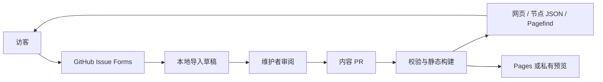

# 首版实现说明

更新：2026-09-06。实现范围对应设计中的首版功能，面向文本问答档案与维护者审核，不包括实时模型生成、站内账号或匿名投稿后端。

## 结构

- `content/`：问题及修订、答案、上下文、注释、关联、发布记录和导入收据。JSON 元数据与 Markdown 正文分离。
- `src/lib/schema.ts`、`content.ts`：字段类型、引用关系、正文哈希、发布祖先闭包、历史不可变规则与路径限制。
- `src/lib/graph.ts`：精确历史路径、归档继承、复制路径和公开数据投影。
- `src/lib/submissions.ts`、`maintenance.ts`：来源快照、导入去重、审核前复查、排他锁、事务替换及中断恢复。
- `src/lib/relations.ts`：中文二元字组与英文词项的 TF-IDF 候选检索。自动候选只表示主题相关。
- `src/pages/`：静态页面；`data/` 路由为按需加载的节点、树和答案 JSON。
- `.github/ISSUE_TEMPLATE/`：四类投稿表单；`.github/workflows/`：PR 验收及 Pages 发布。

## 已实现的页面行为

| 设计能力 | 实际入口与行为 |
| --- | --- |
| 问题浏览 | `/`：主题筛选、根问题列表、最近追问；`/search/`：Pagefind 中文搜索 |
| 固定提问版本 | `/questions/:id/revisions/:revision/`；旧答案引用旧修订，当前修订变化不迁移历史 |
| 多答案 | 问题页面按记录或生成时间排序，未知生成时间置后；所有答案保持独立 ID |
| 分支阅读 | `/explore/:root/?focus=:id`：折叠树、定位、链接分享、按节点加载正文，手机切换目录与阅读 |
| 路径复制 | 答案页面及树阅读区：复制精确祖先路径；排除兄弟答案和横向关联，撤回时标记不完整 |
| 并排比较 | `/compare/?left=:id&right=:id`：同题跨修订比较、条件差异、手机 A/B 切换 |
| 横向关联 | 修订或答案页：理由、片段、确认者、最多 20 邻居的局部 SVG 图，普通链接可遍历更多关系 |
| 投稿 | `/contribute/`：提示公开性、GitHub 账号要求；只把模板和短 ID 预填入 GitHub 链接 |
| 内容维护 | CLI 导入、审阅、修订、注释、候选确认/驳回、归档/重新开放、撤回 |

树把问题、修订、答案分别表现为节点；修订层保证历史回答不会被混入最新提问。默认最多渲染 100 行，深层节点保持可定位。关系图的实线表示回答或追问路径，虚线表示横向关联；只有 `supports` 表示单向支持。横向关联不改变父答案，也不加入上下文。

条件比较仅在提交者声明完整可见历史、实际末轮提问与修订相同、生成规则及显式参数相同且均明确未使用工具时，显示已记录条件一致。协议缺失、相同的部分历史、未核对的附件或工具配置都阻止这一提示；仍不声称能严格重放。页面同时展示供应商与渠道。时间排序处理时间戳的时区偏移；仅知日期的记录按所述日期分组，不补造时分秒，完全未知的排在后面。

## 公开内容边界

所有页面和 JSON 由 `publicStore()` 提供内容，不能从原始存储直接取正文展示。撤回后保留稳定 ID 和必要导航结构，正文、相关片段、被隐藏的上下文以及模型来源自由文本不再导出。一个可见答案的快照若引用撤回节点，整份快照停止公开；该答案的上下文显示为未知。

Markdown 经过标签及链接协议白名单清洗，不执行 MDX、脚本或事件属性。导入拒绝文件路径越界、符号链接、元数据路径与实体不一致。HTML、JSON 与搜索输出有独立撤回构建验证。

普通撤回只影响新的站点版本。Git 历史、源 Issue、已经下载的文件和旧部署需要各自处理；本工具不会承诺远端彻底删除。

## 一致性与恢复

首次导入生成新实体 ID 和本地待审草稿，不直接改正式内容。审核时检查目标是否可见、是否归档以及已存在目标文件是否仍与审阅基准一致，再在完整暂存内容库上校验。

通过后先写事务记录，把旧内容目录移到备份，再切换新目录。成功导入的来源收据和内容在同一次替换中落盘。本地缓存丢失或最后状态写入中断，可以由收据恢复；重复导入不会产生第二份答案。

恢复依据当前目录、备份、事务记录和已提交收据/内容哈希判断。无法判断时保留现场。此机制针对单台维护者机器上的文件更新；多位维护者仍需通过 Git 分支、PR 和合并校验协调。

## 运行与发布边界

构建没有数据库、后台服务、长效凭据或模型 API。默认根路径用于本地及 Sites；`SITE_BASE=/QandA` 用于 GitHub Pages，资源、搜索和数据请求都使用该基路径。

PR 工作流使用只读权限并验证相对目标分支的历史不变性。Pages 发布作业单独获取最小部署权限，按队列执行，并在部署前确认仍是最新 `main`。这些检查保护正常流程；管理员绕过工作流或直接更改托管设置仍需要人工治理。

仓库已由所有者公开并合并首版，投稿模板和 GitHub Pages 已配置。开发样例现已从正式 `content/` 清空，等待真实投稿。真实用户的使用意愿、审核工作量和词项候选质量尚待观察。

自动化测试只在系统临时目录生成夹具，结束时清理，不读取或写入正式内容库；正式 `dist/` 与测试产物分离。清空首批开发样例使用其完整内容、元数据及发布记录的固定指纹，并且只允许变成完全空库；其他删除仍受历史不变性检查约束，不能凭 `is_example` 或作者标签绕过。
